== Dashboard User Guide

=== Configuration

The first step before using FrontLine is to configure your license key.

image::images/configuration.png[Login,align=center]

Once you've filled your license and clicked on the "Next" button you will get the credentials to connect to the superAdmin account. You can change this password in the frontline.conf file.

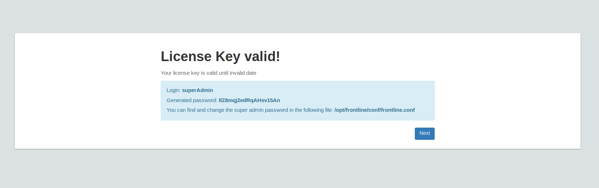

Click on the "Next" button to finish the configuration step and restart FrontLine.

=== Login

Logging in is necessary to use FrontLine. FrontLine is accessible by default on port 10542.

image::images/login.png[Login,align=center, width=35%]

If it is the first time you use FrontLine, you can use the super admin account with the following credentials:

- Login: *superAdmin*
- Password: generated by the configuration step or in the frontline.conf file. You can change it in the frontline.conf file.

If you have configured the OpenID authentication, all of your user base can connect as a viewer. Make sure that FrontLine is allowed to open pop-ups on your browser, or you won't be able to login.
To connect as a superAdmin, click on *Connect with basic credentials* and fill as previously explained. To modify your users permissions, you'll need to go the <<users, users>> page, and modify the users.

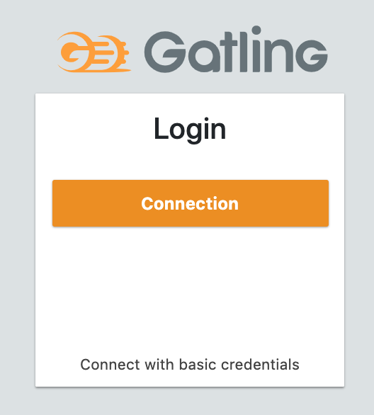

=== Overview

Once you are logged in, you are now able to navigate using the FrontLine navigation bar on the left side.

image::images/navbar.png[Navbar,align=center]

FrontLine is composed of:

- The Profile section, letting a user manage his account settings (not accessible to the superAdmin)
- The Admin section, letting administrators manage teams, users, API tokens, private keys and repositories
- The Simulations section, where runs, trends and simulations can be seen and managed
- The Pools section, where you can configure your cloud and on-premises instances
- The Documentation section, displaying all documentation guides, the link to the Swagger for our public API, and samples for your FrontLine tests
- The About section, letting you know the current version of FrontLine and the expiration date of your license key

We are now going to describe in depth each one of these sections.

=== Admin

==== Managing Teams

To access the Teams administration, click on *Admin* in the navigation bar, and choose *Teams*.

image::images/teams.png[Teams,align=center]

In the teams table, you can visualize the team name, the optional team quota, and the number of associated users, pools and simulations.
You can also copy the team id by clicking on the icon:clipboard[] icon.

===== Teams settings

To open the teams settings, click on *Teams Settings* on the right side of the search bar.

image::images/teams-settings.png[Teams,align=center]

The simulation quota of a team means the number of simulations a team is allowed to own. By default, there won't be any limitation, and your teams will be able to create simulations until you reach the number of simulations defined in your license.

The checkbox *Simulations quotas* needs to be enabled if you want the quotas to be applied. The sum of the quotas needs to be less or equal to the number of simulations allowed by your license. Please note that if this option is enabled, you need to provide a quota for each team, or this team won't be able to create a simulation.

===== Team

To create a team, click on the *Create* button.

image::images/create-team.png[Teams,align=center]

You can edit the team by clicking on the icon:pencil-alt[] icon and delete them using the checkboxes on the table's right part.
Note that you can't edit a quota from this modal, it can only be done from the team settings modal.

[[users]]
==== Managing Users

To access the Users administration, click on *Admin* in the navigation bar, and choose *Users*.

===== Permissions

There are 4 different user roles in FrontLine:

- System Admin
- Team Admin
- Tester
- Viewer

[cols="5*",options="header"]
|===

v|
^| Viewer
^| Tester
^| Team Admin
^| System Admin

v| Access own profile `1`
^| icon:check[]
^| icon:check[]
^| icon:check[]
^| icon:check[]

v| Access Reports
and Trends
^| Own team
^| Own team
^| Own team
^| Own team

v| Start Simulation
^|
^| Own team
^| Own team
^| Own team

v| Generate Public Links
^|
^| Own team
^| Own team
^| Own team

v| Create Simulation
^|
^|
^| Own team
^| Own team

v| Access Pools
^|
^|
^| Own team
^| Own team

v| Manage Pools
^|
^|
^|
^| Own team

v| Administrate Private Keys and Repositories
^|
^|
^| Own team
^| Own team

v| Administrate API Tokens, Users and Teams
^|
^|
^|
^| Own team

|===

Each role can be global or team-specific.

===== User administration

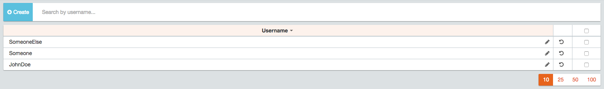

WARNING: If you switch between FrontLine embedded user management system and LDAP/OpenID mode, or if there is a problem fetching your user data in LDAP/OpenID, some users may be flagged as invalid. For example, if a user created in FrontLine doesn't exist in your LDAP/OpenID server, you won't be able to connect with this user anymore.

To create a user, click on the *Create* button. Once the user is created, copy his password, as you won't be able to retrieve it again. OpenID authentication disable user creation, and only allow to edit users permissions (users who have already connected one time).

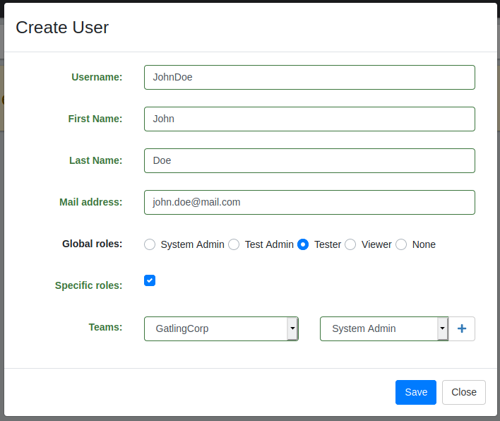

If you are using FrontLine with LDAP or OpenID, you will only have to fill the username and permissions to create a user, the other pieces of information come directly from the LDAP/OpenID. The username should be the same username as in the LDAP/OpenID.

You can edit the user by clicking on the icon:pencil-alt[] icon and delete them using the checkboxes on the table's right part.
To reset a user password, click on the icon:undo[] icon (only available in non-LDAP mode).

It should be noted that the superAdmin account can't be deleted or even modified here.

==== Managing API Tokens

To access the API Tokens administration, click on *Admin* in the navigation bar, and choose *API token*.

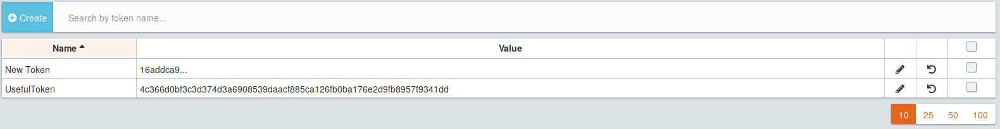

To create an API token, click on the *Create* button. Once the API token is created, copy the token, as you won't be able to retrieve it again.

image::images/create-token.png[Tokens,align=center]

There are three permissions available for an API Token:

- The Start permission, allowing to start simulations (typically useful in a CI like Jenkins)
- The Read permission, allowing to read all the data from runs (typically useful in Grafana)
- The All permission, combining both of the previous permissions

You can edit the API Token permissions by clicking on the icon:pencil-alt[] icon on the right part of the table. A permission can be set globally or to a specific team.
To regenerate a token, click on the icon:undo[] icon.

[[privateKey]]
==== Managing Private Keys

To access the Private Keys administration, click on *Admin* in the navigation bar, and choose *Private Keys*. A private key corresponds to the ssh key used to connect to your Git repository or pool instances.

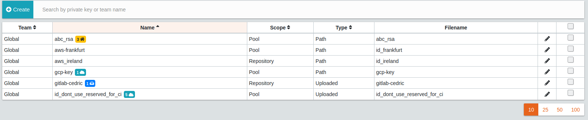

To create a Private Key, click on the *Create* button.

image::images/create-private-key.png[Create Private Key Modal,align=center]

A private key can be scoped on pool or repository. It means that you can only use this private key while configuring a repository or a pool. The all scope can't be choosen, as it is only there for the legacy private keys without scope.

You have two possibilities to reference private keys:

- Upload them directly by drag-and-drop or click on the input to choose the file on your filesystem
- Locate a private key existing on FrontLine's host. The private key permissions should be 600 or 400, and its owner should be the FrontLine process user

NOTE: If you are using the AWS marketplace offer and wish to reference an existing private key, you must connect with the `ec2-user` user and then `sudo` to the `frontline` user which is the one running the FrontLine process.

You can edit the private key by clicking on the icon:pencil-alt[] icon and delete them using the checkboxes on the table's right part.

[[managing-repositories]]
==== Managing Repositories

To access the repositories administration, click on *Admin* in the navigation bar, and choose *Repositories*

There are 2 types of repository: the ones where you download and compile the sources, and the others where you download an already-compiled project

image::images/repositories.png[Repositories,align=center]

To create a repository, click on the *Create* button.
You can edit the repository by clicking on the icon:pencil-alt[] icon and delete them using the checkboxes on the table's right part.

===== General

image::images/create-repository.png[Repository creation,align=center]

- *Name*: the name that will appear on the repositories table.
- *Team*: set if the repository is global or owned by a team
- *Repository Type*: the desired type of your repository

===== Sources Repository

Choose *Build from sources* as repository type if you wish that FrontLine fetch and compile the sources of your Gatling simulation. In this page, you'll configure how to fetch the sources.

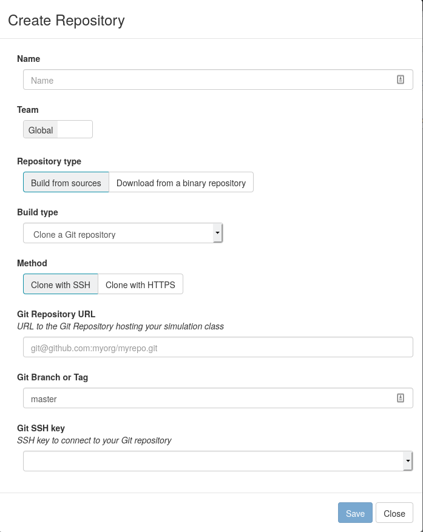

There are 3 different ways to retrieve your sources:

- *Clone a Git repository*: If you want to clone a git repository. You'll need to fill in the URL of the targeted repository, and the targeted git branch or tag (which can be overridden in the simulation configuration). If you're using ssh authentication, you can also fill in a previously added <<privateKey, private key>> scoped on repository with *Git SSH key*. If you're using HTTPS authentication, you can setup an username and password.
- *Use a project on FrontLine's filesystem*: Use a project located on FrontLine's filesystem, fill in the path to project repository.
- *Check out from Source Code Control System*: Useful if you're using a code control system other than Git, or if you need a really specific Git command.

====== Binary Repository

Choose *Download from a binary repository* if you already compiled your project and pushed to a binary repository.

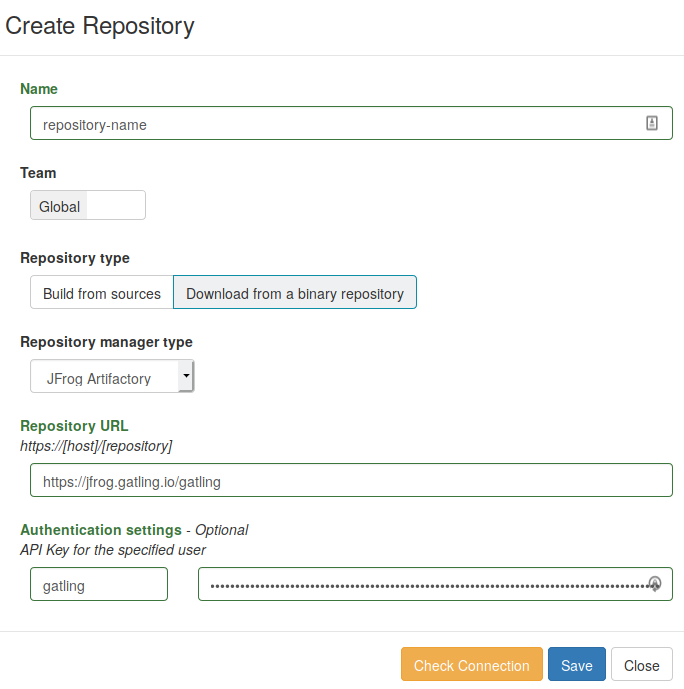

We currently support 4 different providers: JFrog Artifactory, Sonatype Nexus 2 & 3, AWS S3.

If you're using an Artifactory or Nexus repository, you'll need to fill in the following fields:

- *Repository URL*: the URL of the targeted repository
- *Authentication settings*: the key for the jar you want to download
* *Username*: the username of the user with sufficents permissions
* *API Key*: link:https://www.jfrog.com/confluence/display/RTF/Updating+Your+Profile#UpdatingYourProfile-APIKey[API key for the current user]

WARNING: make sure to follow the Repository URL pattern as follow

- JFrog Artifactory : http[s]://<host>/<repository>
- Sonatype Nexus 2  : http[s]://<host>/nexus/content/repositories/<repository>
- Sonatype Nexus 3  : http[s]://<host>/repository/<repository>

How to find the repository URL?

- Artifactory :

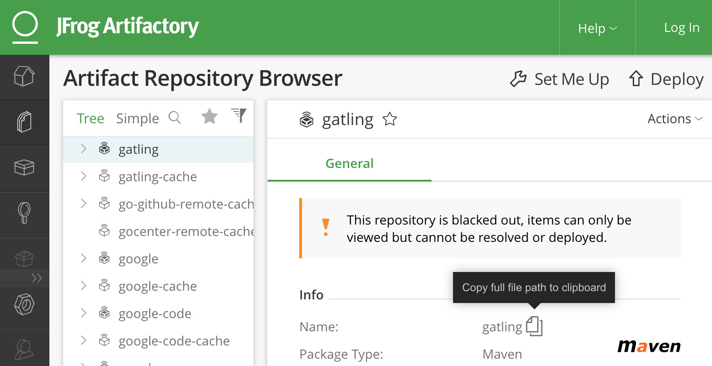

- Nexus :

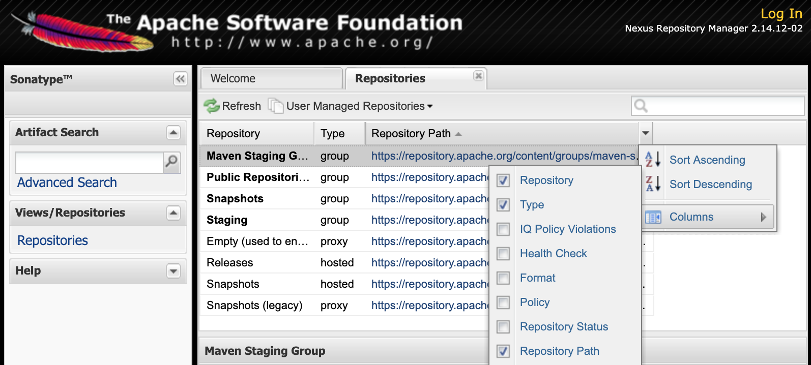

If you're using an AWS S3 bucket, you'll need to fill in the following fields:

image::images/create-repository-s3.png[Repository creation,align=center]

- *Profile name*: choose a profile described in `~/.aws/credentials`, or select `Use environment or system variables` to use the permissions granted to the EC2 FrontLine instance
- *Region*: the region where you created your bucket
- *Bucket name*: the bucket name

Before saving, we advice to check the connection to the repository by clicking on the *Check Connection* button.

NOTE: Profile name requires the following permissions to be able to download from the AWS S3 repository

[source, json]
----
{
    "Version": "2012-10-17",
    "Statement": [
        {
            "Action": [
                "s3:GetObject"
            ],
            "Effect": "Allow",
            "Resource": "arn:aws:s3:::DOC-EXAMPLE-BUCKET/*"
        }
    ]
}
----

=== Accessing your profile

You can view your profile at any time by clicking on the *My Profile* button in the navigation bar.

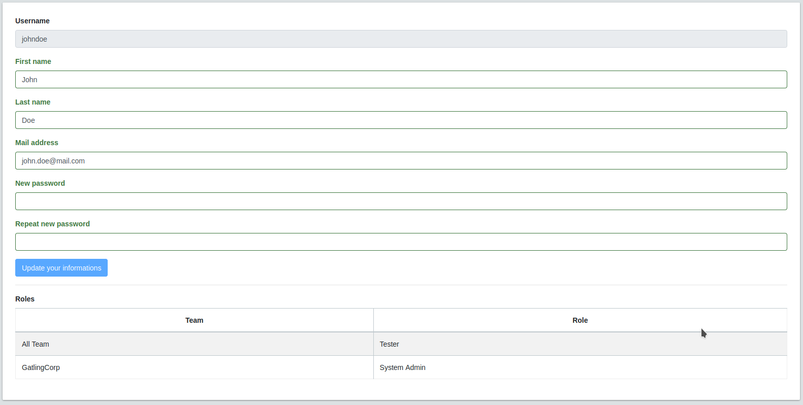

The informations displayed are the following:

- Username
- First and Last name
- Mail address
- Different roles

To update your profile, modify the fields you want to change, then click on the button *Update your informations*.

You can't update your username here. You need to ask a System Admin to change your roles on the *Users Admin* page.

It should be noted that the superAdmin account doesn't have a profile.

If you are using FrontLine with LDAP, profiles will be read-only since users information are retrieved from the LDAP and not managed by FrontLine itself.

[[pools]]
=== Pools

The Pools view is split by pool type, each in a different tab.
There are currently 6 types of pool:

- <<on-premises, On-premises>>: a pool which contains hosts configured manually
- <<aws, AWS>>: used to spawn instances on a configured AWS account
- <<gce, GCE>>: used to spawn instances on a configured GCE account
- <<openstack, OpenStack>>: used to spawn instances on a configured OpenStack account
- <<azure, Microsoft Azure>>: used to spawn instances on a configured Microsoft Azure account
- <<kubernetes, Kubernetes>>: used to spawn instances through your configured Kubernetes/OpenShift

If you are using the AWS marketplace offer, you will only have access to the On-premises, AWS, and Kubernetes pools.
If you are using the Azure marketplace offer, you will only have access to the On-premises, Azure, and Kubernetes pools.

==== Warning about Private Keys

Every pool except Kubernetes will need to have a <<privateKey, Private key>> configured, and scoped on Pools. You won't be able to create one of these pools if you have not created a private key.

image::images/pools.png[Pools,align=center]

[[on-premises]]
==== On-premises

Here you can create an On-premises pool which represents existing machines.

The pool is defined by a name and a team:

image::images/on-premises-pool.png[CreatePool,align=center]

You can edit the name and set if the pool is global or owned by a team by clicking on the icon:pencil-alt[] icon of that pool in the table.
If you click on the name, it will highlight all the hosts which are in this pool in the host table.

You can delete one or more pool by selecting them and click on the *Delete* button above the table. The number of simulations associated to the pool is also displayed.

Now you need to create an host and assign it to the pool. To do so, you need to fill the following form:

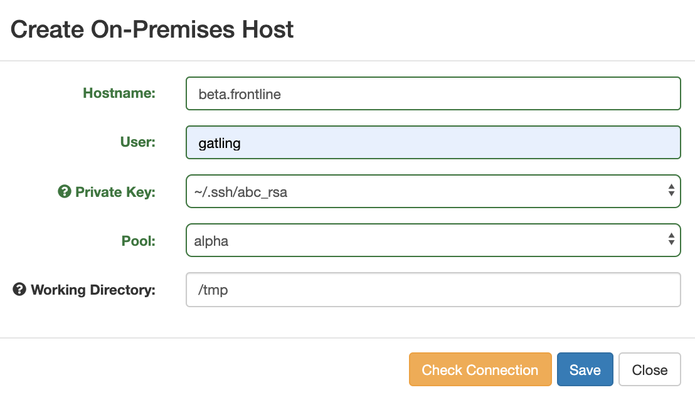

An host is basically a server where the FrontLine server will upload the binary to use it as an injector for the test.

- *Hostname*: the hostname of the server
- *User*: the username to use for the connection to the server
- *Private Key*: the private key used by the server for SSH authentication
- *Pool*: Choose the pool to assign the host. You can select `Unassigned Hosts` if you don't want to put your host into a pool yet.
- *Working Directory*: Directory on the host where the code will be launched, it needs to be executable

To be sure that FrontLine can access to the host you can click on the *Check connection* button.

You can edit your hosts by clicking on the icon:pencil-alt[] icon in the hosts table.
You can duplicate an host to quickly create an host with the same parameters by clicking on the icon:file[] icon of the host on the table.

image::images/duplicate.png[Duplicate,align=center]

If you select one or more hosts, you will see a new button named *Action* appear on the search bar above the table which allow
you to delete all the selected hosts or to switch pool to another for all selected hosts.

image::images/hosts-actions.png[Dropdown,align=center]

You can sort the pool table or the host table by clicking on their respective columns.

[[aws]]
==== AWS Pool

An AWS Pool is a reference to the AWS account you want to use to spawn injectors to run the simulation.
To configure the type of instances you want to spawn, you need to fill the form below:

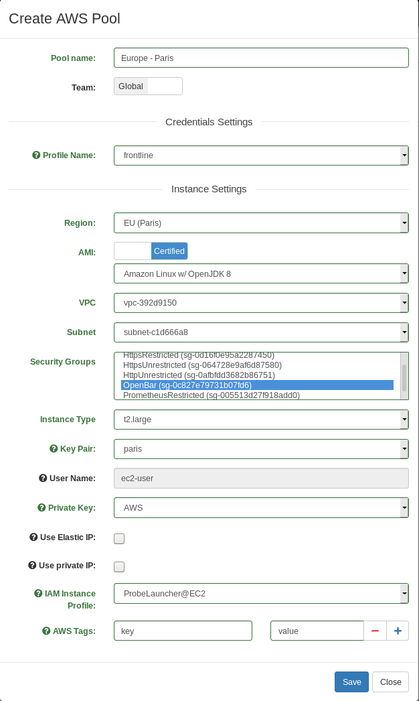

- *Team*: Set if the pool is global or owned by a team
- *Profile Name*: Name of the AWS profile described in the AWS credentials file. If you want to use System or Environment properties instead of this file, choose `Use environment or system variables`
- *Region*: the region where to spawn your instances
- *AMI*: the AMI you want to use for your instances. You can use our certified AMIs or the ID of your custom AMI (the AMI should at least have JDK8 installed, a configured key pair without password and the port 22 & 9999 should be open)
- *VPC*: the VPC in which your instance will be created
- *Subnet*: the subnet in which your instance will be created
- *Security Group*: the security groups the instance will use
- *Instance Type*: the type of the instances you want to spawn
- *Key Pair*: the Key pair name used by your AMI
- *User Name*: the username used by your ssh command to connect to the instances. If you use one of our certified AMIs, the username will be ec2-user
- *Private Key*: the previously added <<privateKey, private key>> used by your AMI
- *Use Elastic IP*: Allow instances to use predefined Elastic IP
- *Use private IP*: FrontLine will use the injector private IP instead of the public one by default. If unchecked, the private IP remains a fallback if a public IP is missing. This option should be used only when the FrontLine host and the injector are both on AWS on the same network.
- *IAM Instance Profile*: optional step, you can specify an IAM instance profile to grant injectors permissions
- *AWS tags*: optional step, the tags will be visible in your AWS interface, hence you will be able to monitor them

WARNING: If you're using our certified AMIs, make sure that you add a security group allowing Internet access.
This is required for automatic critical security updates checks done by the OS.

[[gce]]
==== GCE Pool (On-premises license only)

Like the AWS Pool, a GCE Pool is a reference to the GCE account you want to use to spawn injectors to run the simulation.
To configure the type of instances you want to spawn, you need to fill the form below:

image::images/gce.png[GCE Pool,align=center]

- *Team*: Set if the pool is global or owned by a team
- *Credentials*: If you're running Frontline on GCE or using `GOOGLE_APPLICATION_CREDENTIALS` to configure access, use 'Application Default'. Otherwise, use JSON credentials.
- *Zone*: the zone where you want to spawn your injectors
- *Private Key*: the previously added <<privateKey, private key>> used by your Template
- *Use private IP*: check this if you want your injectors to use their private IP instead of the public one
- *Deployment*: You can choose to spawn GCE instances from an image or an instance template

Specific configuration if you chose Image:

- *Image*: the image you want to use for your instances. You can use our certified Images or the url of your custom Image (the Image should at least have JDK8 installed and a configured key pair without password)
- *Machine type*: this machine type will be used by the injectors. We recommend using n1-highcpu-4 or n1-highcpu-8 machines.
- *Subnetwork*: the subnetwork the instances will use
- *Preemptible*: check this if you want to use preemptible instances (cheaper, but can be reclaimed by GCE)
- *Public SSH key*: content of the public SSH key used to connect to the instances
- *Network tags*: networks tags you may want to apply to the instances
- *Use Static IPs*: check this if you want your injectors to use predefined static IPs

Specific configuration if you chose Instance Template:

- *Template*: the template used for your instances, the template should at least have JDK8 installed, a configured key pair without password and the port 22 & 9999 should be open
- *Username*: the username used by your ssh command to connect to the instances

[[openstack]]
==== OpenStack Pool (On-premises license only)

Like the others pools, an OpenStack Pool is a reference to the OpenStack account you want to use to spawn injectors to run the simulation. We only support Keystone version 3.
To configure the type of instances you want to spawn, you need to fill the form below:

image::images/openstack.png[OpenStack Pool,align=center]

- *Team*: Set if the pool is global or owned by a team
- *Identity Endpoint*: complete url of your OpenStack API (eg: https://auth.cloud.ovh.net/v3)
- *Identity*: your OpenStack identity, it is most of the time: `domain:username`
- *Credentials*: Account password
- *Scope*: you can use scoped authentication (eg: `project:myprojectname`)
- *Region*: the region where to spawn your instances
- *Key Pair*: the Key pair name use by your image
- *Image*: the image used for your instances (the image should at least have jdk8 installed and a configured key pair without password and the port 22 & 9999 should be open)
- *Flavor*: the flavor used for your instances
- *Security Group*: the security group of your account
- *Username*: the username used by your ssh command to connect to the instances
- *Private Key*: the previously added <<privateKey, private key>> used by your images
- *Availability Zone*: the optional availability zone

[[azure]]
==== Microsoft Azure Pool (On-premises license and Azure Marketplace only)

A Microsoft Azure Pool is a reference to the Azure account you can use to spawn injectors to run the simulation. Only Linux virtual machines are supported.

To configure the type of instances you want to spawn, you need to fill the form below:

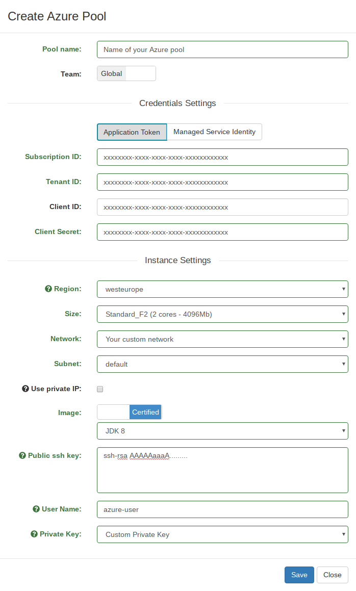

- *Team*: Set if the pool is global or owned by a team
- *Subscription ID*: the Azure subscription you want to use, check https://www.inkoop.io/blog/how-to-get-azure-api-credentials/ to retrieve it
- *Tenant ID*: the Azure tenant you want to use
- *Client ID*: the id of the Azure client you want to authenticate with
- *Client Secret*: the key used to authenticate
- *Region*: the region where you want to spawn your instances
- *Size*: the size of the instances
- *Network*: the network configured on your Microsoft Azure account you want to use
- *Subnet*: the subnet you want to use
- *Image* or *Image URL*: the certified image or the url of the image you want to use for your instances. You can use our certified images or the url of your custom VHD: the image should at least have JDK8 installed, a configured key pair without password and the port 22 & 9999 should be open, see the https://docs.microsoft.com/en-us/azure/virtual-machines/virtual-machines-linux-capture-image[Azure documentation] if you want to make your own image
- *Public Key*: the public ssh key to connect to your instances
- *Username*: the username used by your ssh command to connect to the instances
- *Private Key*: the previously added <<privateKey, private key>> associated with the public ssh key

It's also possible to use User Assigned Managed Identities, refer to the installation guide if you want to create a Managed Identity:

image::images/azure-msi.png[User Assigned Managed Identities,align=center, scaledwidth="90%"]

[[kubernetes]]
==== Kubernetes/OpenShift Pool

A Kubernetes/OpenShift Pool is a reference to your Kubernetes infrastructure.

To configure the type of instances you want to spawn, you need to fill the form below:

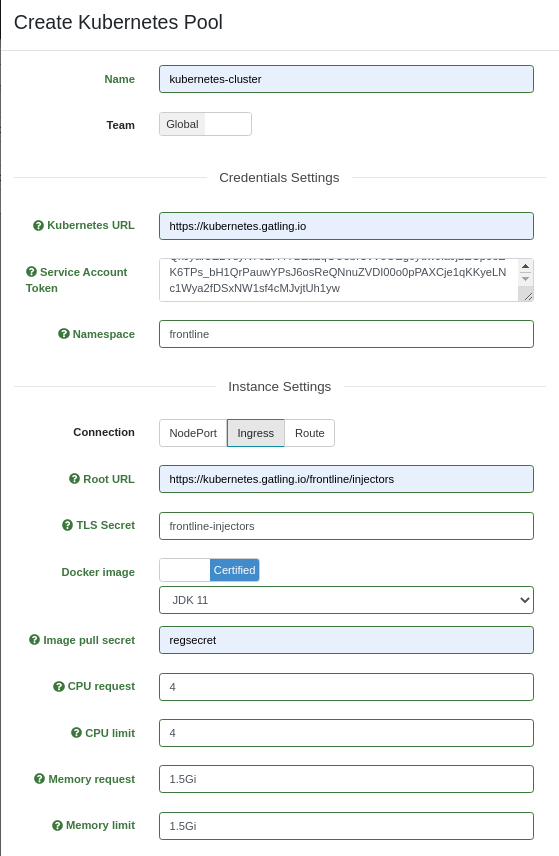

- *Team*: Set if the pool is global or owned by a team
- *Kubernetes Url*: The url of your Kubernetes API with the protocol
- [[service-account-token]]*Service Account Token*: The token of your service account which has edit permissions on the namespace below (see <<needed-permissions, needed permissions>>)
- *Namespace*: The namespace/project name in which injectors will be spawned
- *Connection*:
* *NodePort*: exposes the Service on each injector Node's IP at a static port
* *Ingress*: exposes HTTP and HTTPS routes from outside the cluster to injectors within the cluster
** *TLS secret name*: the optional secret containing a certificate used by the ingress (link:https://kubernetes.github.io/ingress-nginx/user-guide/tls/#tls-secrets[TLS secrets documentation])
* *Route*: (OpenShift extension) exposes HTTP routes (HTTPS not supported) from outside the cluster to injectors within the cluster.
** *Secured*: allow you to add the desired certificate on the route (link:https://docs.openshift.com/container-platform/4.5/networking/routes/secured-routes.html[OpenShift secured routes documentation])
*** *Certificate*: Certificate associated with the route
*** *Certificate key*: Certificate key associated to certificate
*** *CA Certificate*: Certificate authority signing the certificate

- *Docker Image*: Docker image that will be used for injectors. You can use our certified Docker images if your Kubernetes cluster has access to Docker Hub, or build your own with https://github.com/gatling/frontline-injector-docker-image
- *Image pull secret*: Recommended approach to run containers based on images in private registries and / or to not be limited by rate limits
- *CPU request*: The minimum number of cores that you need for each one of your injector, express as cpus
- *CPU limit*: The limit of cores that you don't want your injector pod to exceed, express as cpus
- *Memory request*: The minimum memory that you need for each one of your injector
- *Memory limit*: The maximum memory that you need for each one of your injector

Limits and requests for memory are measured in bytes. You can express memory as a plain integer or as a fixed-point integer using one of these suffixes: E, P, T, G, M, K. You can also use the power-of-two equivalents: Ei, Pi, Ti, Gi, Mi, Ki.

NOTE: If your FrontLine instance belongs to a Kubernetes cluster, you don't have to provide a *Kubernetes Url* and a *Service Account Token*.
You can still choose to configure it, for example to create a pool in another cluster, by unticking `Use local cluster`.
Also, you can specify preferring *Internal IP* over the *External IP* for connecting to Kubernetes nodes, by ticking `Prefer internal IP`.

image::images/kubernetes-local.png[Kubernetes,align=center, width=90%]

===== Minimal permissions for FrontLine service account

Service account associated to the <<service-account-token, token>> must be binded with permissions to manage services, nodes, routes, ingresses and pods (depending on your needs).
Below, you can find a commented configuration file containing all needed permissions.

[[needed-permissions]]
[source, yaml]
----
include::../commons/kubernetes-frontline-sa.yml[]
----

[[simulations]]
=== Simulations

To access the Simulations section, click on *Simulations* in the navbar.

The Simulations view contains all the simulations you have configured and the result of their last run.

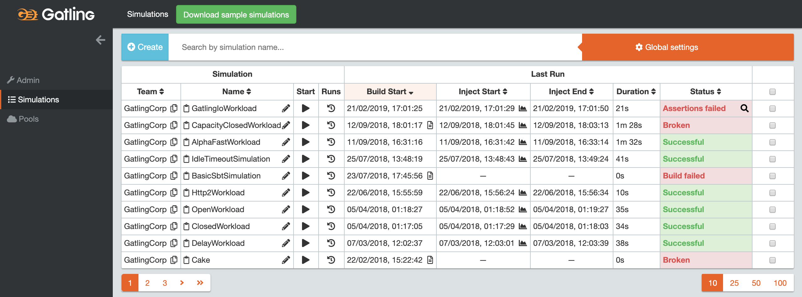

If you don't have any simulations configured yet and don't know how to start, you can download some FrontLine pre-configured projects by clicking on the "Download sample simulations" green button.

image::images/samples.png[Samples,align=center]

Those samples are ready to use maven, sbt and gradle projects with proper configuration for FrontLine. You can also download those samples with the download link in the Documentation section.

Back to the Simulations section, at the top, there is an action bar which allow several actions:

- Create a simulation
- Search by simulation or team name
- Edit global properties
- Delete selected simulations

image::images/action-bar.png[Action bar,align=center]

==== Global Properties

Global properties contains every JVM options and system properties used by all of your simulations by default.
Editing those properties will be propagated to all the simulations.

If you don't want to use the default properties, check `Use custom global properties` and enter your own.

image::images/properties.png[Properties,align=center]

If you want specific properties for a simulation, you will be allowed to ignore those properties by checking the `Override Global Properties` box when creating or editing the simulation:

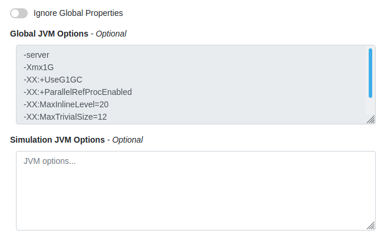

==== Creating a simulation

WARNING: FrontLine has a hard run duration limit of 7 days and will abort any test running for longer than that.
This limit exists for both performance (data who grow too humongous to be presented in the dashboard) and security (forgotten test running forever) reasons.

In order to create a simulation click on the "Create" button in the simulations table. There are 6 steps to create a simulation, 3 of which are optional.

===== Step 1: General

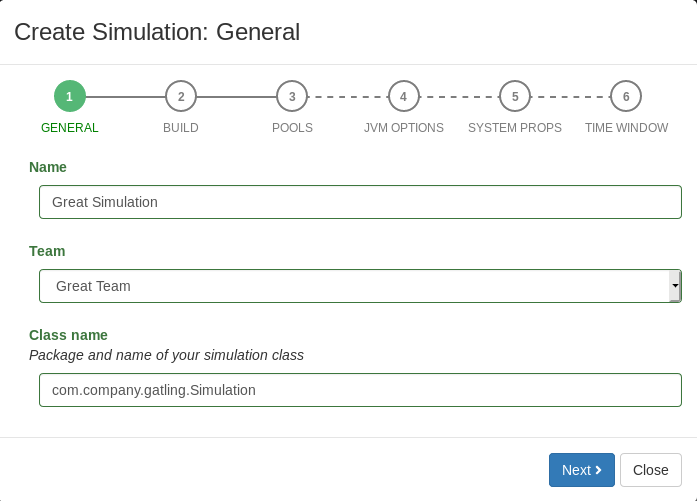

- *Name*: the name that will appear on the simulations table.
- *Team*: the team which owns the simulation.
- *Class name*: the package and the name of your simulation scala class in the project that you want to start.

===== Step 2: Build configuration

In this step, you'll describe which <<managing-repositories,repository>> FrontLine will use, and how to use it.

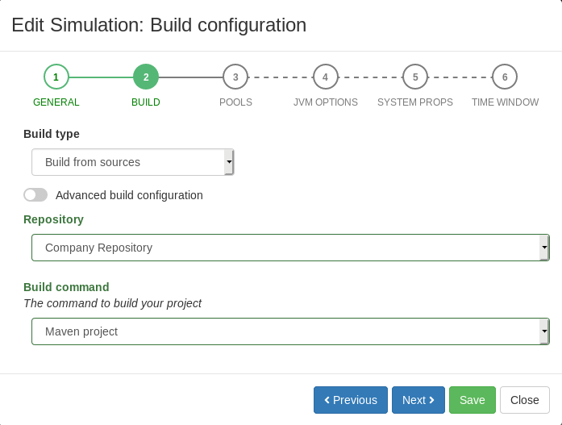

- *Build type*: How you want to retrieve and build your simulation. You may choose to build from sources, download a binary from a Sonatype Nexus or JFrog Artifactory repository, or download a binary from an AWS S3 bucket.
- *Repository*: The <<managing-repositories,repository>> you created previously

====== Option 1: Build from sources

In this step, FrontLine will download the sources from your repository, and compile them.

- *Build command*: the command to build your project. Three common commands are built-in for projects whose build tools configuration follow our installation guide:
  * `mvn clean package -DskipTests --quiet` for maven project
  * `sbt -J-Xss100M ;clean;test:assembly -batch --error` for sbt project
  * `gradle clean frontLineJar -quiet` for gradle project

WARNING: Please make sure that the tools you are using are installed and available on the FrontLine machine, for example: `mvn`,  `sbt`, `git`, and `ssh`.

You can provide optional settings if you toggle *Advanced build configuration*.

- *Relative path*: the path to you simulation project in your repository (eg the Gatling simulation is not at the root of your git)
- *Environment variables*: the environment variables to be used along the build command. You can add as many environment variables as you want
- *Git Branch or Tag*: if you're using a git repository, you may specify another branch or tag than the one configured in the repository configuration

====== Option 2: Download binary from repository

In this step, you'll describe how FrontLine will download a jar deployed in an previously added repository.
This jar must have been built with the same maven/sbt/gradle configuration as described in the Developer section in this guide.

image::images/create-simulation2c.png[CreateSimulation,align=center, scaledwidth="75%"]

- *Artifact Maven coordinates*: the maven coordinates of the desired artifact. _version markers are not supported_

====== Option 3: Download binary from AWS S3

In this step, you'll describe how FrontLine will download a jar deployed in an AWS S3 bucket.
This jar must have been built with the same maven/sbt/gradle configuration as described in the Developer section in this guide.

image::images/create-simulation2b.png[CreateSimulation,align=center, scaledwidth="75%"]

- *Key*: the key for the jar you want to download

===== Step 3: Pools configuration

In this step, you'll configure the pools used for the FrontLine injectors.

image::images/create-simulation3.png[CreateSimulation,align=center, scaledwidth="75%"]

- *Weight distribution*: on even, every injector will produce the same load. On custom, you have to set the weight in % of each pool (eg the first pool does 20% of the requests, and the second does 80%). The sum of the weight should be 100%.
- *Pools*: defines the pools to be used when initiating the FrontLine injectors, see the section about <<pools, pools>>.
You can add many pools with a different number of hosts to run your simulation.
If you have more hosts than needed on your Pool, the hosts will be chosen randomly between all hosts available in this Pool.

After this step, you can save the simulation, or click on *More options* to access optional configuration.

===== Step 4 & 5: JVM options & Java System Properties

These steps allows you to defines JVM arguments and system properties used when running this particular simulation. You can choose to override the global properties.

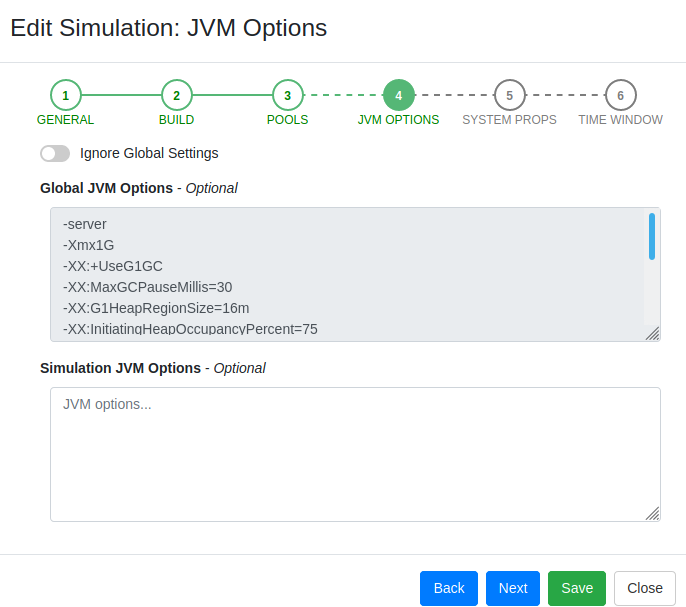
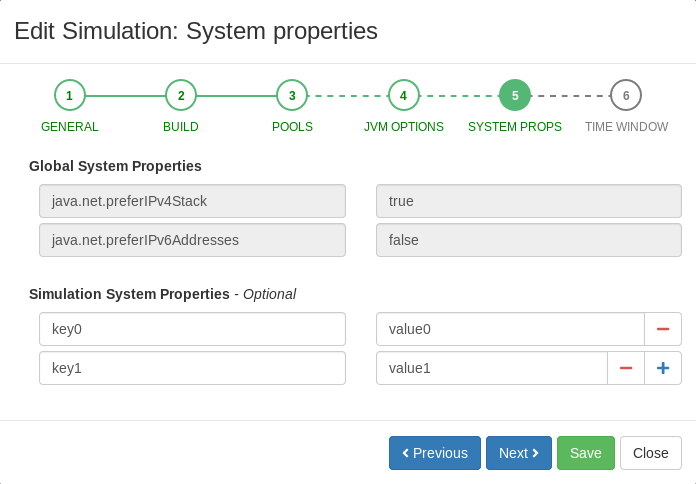

NOTE: JVM options and Java System Properties will be saved in a snapshot that will be available in the run. This information will be visible by anyone who has read access.
You can exclude some properties from being copied if you prefix them with `sensitive.`.

NOTE: You can configure the `gatling.frontline.groupedDomains` System property to group connection stats from multiple subdomains and avoid memory issues when hitting a very large number of subdomains.
For example, setting this property as `.foo.com, .bar.com` will consolidate stats for `sub1.foo.com`, `sub2.foo.com`, `sub1.bar.com`, `sub2.bar.com` into `*****.foo.com` and `*****.bar.com`.

===== Step 6: Time window

Configuring a ramp up or ramp down means that the start and end of your simulation won't be used for calculating metrics and assertions.

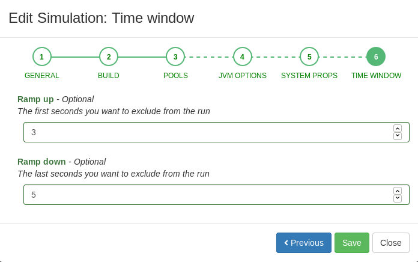

- *Ramp Up*: the number of seconds you want to exclude at the beginning of the run.
- *Ramp Down*: the number of seconds you want to exclude at the end of the run.

NOTE: Ramps parameters will only be applied if the run duration is longer than the sum of the two.

[[simulation-table]]
==== Simulations table

Now that you have created a simulation, you can start it by clicking on the icon:play[] icon in the *Start* column of the table.

image::images/start.png[Launch,align=center]

A run have the following life cycle:

- *Building*: in which it will download and build the simulation from the sources, preparing the hosts if needed
- *Deploying*: in which it will deploy the simulation to run on all the hosts
- *Injecting*: in which the simulation is running and viewable from the Reports

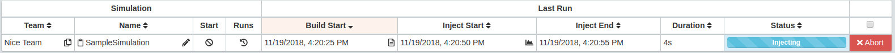

[[logs]]
By clicking on the icon:file-alt[] icon in the *Build Start* column, Frontline will display the build logs of the simulation. There is a limit of 1000 logs for a run.

image::images/logs.png[Logs,align=center]

[[assertions]]
You can click on the icon:search[] icon next to the status (if there is one) to display the assertions of the run.
Assertions are the assumptions made at the beginning of the simulation to be verified at the end:

image::images/assertions.png[Assertions,align=center]

==== Useful tips

- You can edit the simulation by clicking on the icon:pencil-alt[] icon next to his name
- You can search a simulation by his name, or its team name
- You can sort the simulations by any column except the *Start* one
- A *Delete* button will appear on the action bar when you select a simulation, you will be able to delete all the selected simulations
- When a simulation is running, you can abort the run by clicking on the Abort button
- You can copy a simulation ID by clicking on the icon:clipboard[] icon next to his name

Be aware that deleting a simulation will delete all the associated runs.

[[run-trends]]
==== Run / Trends

Runs list and trends can be accessed by clicking on the icon:history[] icon in the <<simulation-table, simulations table>>.

This view contains the list of your simulation's runs which can be filtered by name and/or status and the Trends which are displaying information between those runs.

image::images/run-trends.png[Runs/Trends,align=center]

[[runs-table]]
===== Runs table

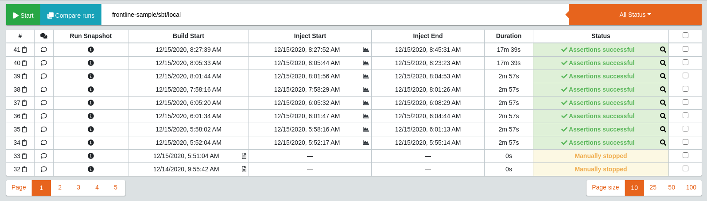

Like the result of the latest run in the <<simulation-table, simulations table>> you have access to the <<logs, logs>> of the run by clicking on the icon:file-alt[] icon and you can sort the table by each columns. The logs are only available for run which are not flagged as "Successful".

If there is one, You can click on the icon:search[] icon next to the status to display the <<assertions, assertions>> of the run.
You can delete runs by selecting them and click on the *Delete* button in the action bar above the table.

You can comment a run by clicking on the icon:comment-alt[] icon on the right side of the table.

image::images/comment.png[Comment,align=center, width=400%]

You can also click on the icon:info-circle[] icon to see a snapshot of the run configuration. The system properties beginning with `sensitive.` are not displayed.

image::images/snapshot.png[Snapshot,align=center]

===== Run Comparison

image::images/compareRuns.png[CompareRuns,align=center]

You can compare the results of two runs if you click on the "Compare runs" button in the table. It allows you to compare the response time and errors of the two runs for each request.

You can choose the specific metric you want to compare by clicking on the metric name, and the specific run you want to compare by clicking on the run number.

The delta and variance will be displayed, so you can check if there is a progression or a degradation in performance.

===== Trends charts

The trends are charts that will display some globals statistics for each runs (eg: requests count) so that you can easily see how well your runs went compared to each other.
Each run is represented by his number in the chart and the chart won't display the statistics of a failed run (eg: Timeout, broken, etc..).

image::images/trends.png[Trends,align=center]

You can filter the statistics shown by filtering through scenarios, groups or requests that are involved in each runs.
You can chose how many runs will be compared by changing the limit (10, 25, 50, 100):

image::images/trends-bar.png[TrendsBar,align=center]

[[reports]]
==== Reports

The reports can be accessed by clicking on the icon:chart-area[] icon in the <<simulation-table, simulation table>> or in the <<runs-table, runs table>>.

This view introduce all the metrics available for a specific run.
This page consists of:

- <<top-navigation, The top navigation bar>>
- <<timeline, The timeline>>
- <<tabs, Tabs>>
- <<run-bar, The run bar>>
- <<charts, Charts area>>
- <<summary, The summary>> (only for requests and groups tabs)
- <<export, Export PDF>>

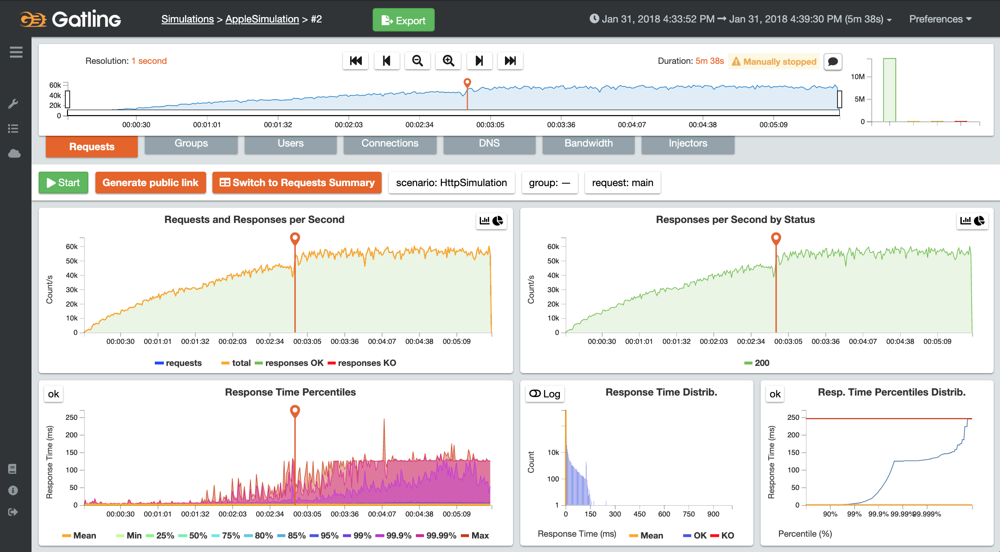

[[top-navigation]]
===== Top Navigation Bar

The navigation bar enable you to choose the simulation time range.

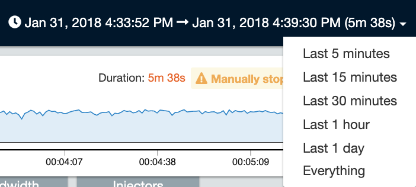

[[timeline]]
===== Timeline

The timeline contains metrics of the full run providing an overview of the run.
Global informations are available such as the resolution and the simulation name.

The resolution indicates the number of seconds per data point in the graph.

You can change the time range with control buttons or by selecting a region on the timeline:

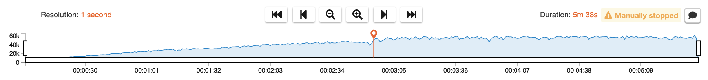

===== Assertions

The label below is used to display the status of the simulation (Ongoing, successful, timeout...).
If your simulation has assertions, this label will be clickable to show the assertions results.
You can comment the run run by clicking on the icon:comment-alt[] icon.

image::images/timeline-assertions.png[Assertions,align=center,width=400%]

[[tabs]]
===== Tabs

Below the navigator chart, there are tabs to switch charts.
Each tab has the same structure except the summary that is available only for requests and groups tabs.

image::images/tabs.png[Tabs,align=center]

[[run-bar]]
===== Run Bar

This bar is a combination of buttons:

- *Start / Abort*: Use this button to start a new run of the simulation, or stop the ongoing run (not available if you have a Viewer permission)
- *Grafana*: Link to the Grafana dashboard if you have filled in the configuration in frontline.conf
- *Generate public link*: To create a public link
- *Switch to Summary*: Switch to <<summary, summary>> view for Requests & Groups tabs
- buttons to filter the metrics drawn in the charts area

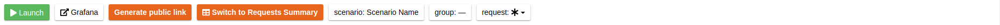

====== Generate Public Links

A public link is a link of the current reports which will be accessible to anyone, without having to log-in to FrontLine. To generate a public link, click on the *Generate public link* button and choose the expiration date of your link.

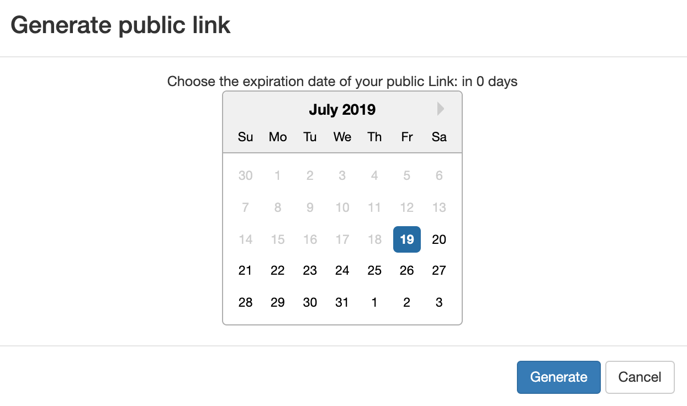

The maximum allowed lifetime for a public link is 1 year.

Once you have chosen an expiration date, you can proceed by clicking on the generate button.

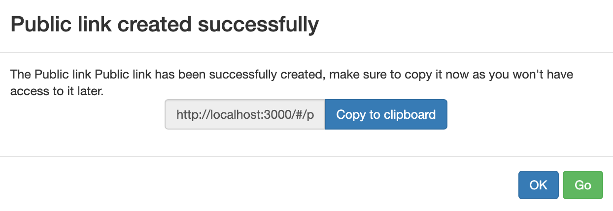

You can copy the public link to share your reports to non-FrontLine users, or click on the "Go" Button to access it yourself. You can click on the "OK" button to close this modal.

[[charts]]
===== Charts

Each charts in FrontLine are connected to each other, so if you select a time window on a chart it will automatically change it
for all other charts. Metrics are drawn in multiple charts.

image::images/charts.png[Charts,align=center]

Some of them have an icon to update the chart settings:

image::images/distrib-chart.png[DistributionChart,align=center]

Moreover, histograms and pies are hidden behind each counts charts, accessible by clicking their top right corner icon below.

image::images/pie-button.png[PieChart,align=center]

WARNING: If your kernel version is too low (around below 3.10) you might not be able to get data from the TCP connection by state graph on the Connections tab. If you want to be able to get these data, you should upgrade your kernel.

[[summary]]
===== Summary (Requests and Groups only)

This view is available only from requests and groups tabs.
It is a summary of metrics drawn in the charts, and has two modes: flat, by default, and hierarchy.
The summary is also connected to the timeline and the time window selected, so if you change the time window the summary
will refresh his data to match the time window.

On Flat mode you can filter the data by clicking any column name of the table.

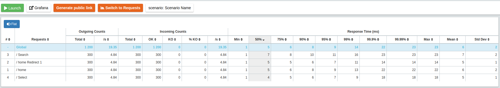

[[export]]
===== Export PDF
When clicking on the green button in the navigation bar, you will have access to a page where you can configure and then export a PDF report of a specific simulation.

image::images/export-button.png[Export,align=center]

This report is initialized with:

- a title element with the date of the run you were coming from
- the run status
- the run comments
- the run assertions
- the run requests summary
- 3 charts of the run:
* Requests and Responses per second
* Responses per Second by Status
* Response Time Percentiles

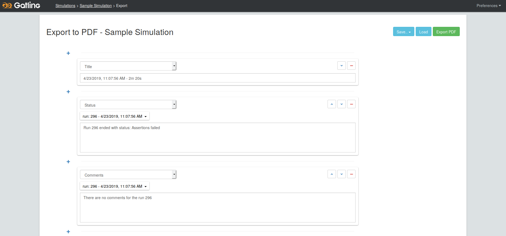

This page is a configurable list of different elements that will be displayed in the report. You can click on the blue add button under every element
to add another one.

Every element can be moved up or down by clicking on the blue arrow on the top right of the element, or be removed by clicking on the red dash.

Those elements are composed of:

- *Title*: add a title element.
- *Text Area*: add an editable text element.
- *New Page*: allow you to skip a page in the report.
- *Run*:
* *Status*: add an editable text element with a predefined text set to the status of the selected run.
* *Comments*: add an editable text element with a predefined text set to the comments of the selected run.
* *Assertions*: add a table with the assertions of the selected run.
* *Summary*: add the summary table of the selected run in a new landscape page.
- *Chart*: add a chart element that you can interact with before exporting it to PDF.
- *Counts*: add a count chart element that you can interact with before exporting it to PDF.

As you can see below, every charts (or other elements) can be interact with individually. You can zoom on it, or select the run, the scenario,
the group, etc.. whose you want your data to be fetch. You do not need to have the same settings for each element.

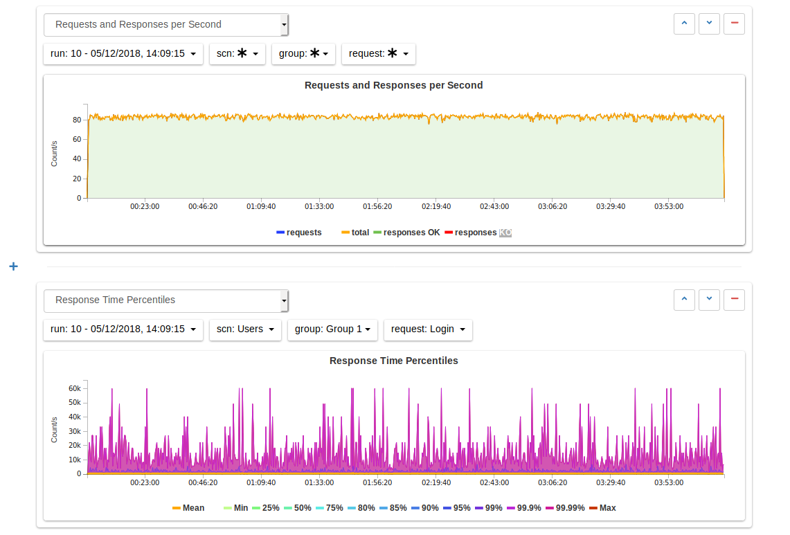

After adding all desired elements in the report you can click on the *Export PDF* button on the top right to get your PDF file.

image::images/export-actions.png[Export,align=center]

There are two more actions you can do:

- *Save*: save the current Export configuration:
* *as a template*: this option will save the element list without the content
* *as a save*: this option will save everything, including the content of the Text Area and the configuration of the graphs
- *Load*: load a previously saved template or save.

===== Useful Tips

====== Zoom

You can reset zoom by double clicking on a chart.
It is possible to change the time range window by the following actions:

- Clicking zoom icons of the control buttons
- Select a zone in any charts and timeline
- Select a range time from the top navigation bar

====== Markers

To ease your analysis, you can create markers on all the charts by right clicking on them. And click on the top of the marker to delete it.

image::images/marker.png[Marker,align=center]

====== Multiple Highlights

In the top right menu, you can activate the *Multiple Highlights* setting which allows the tooltip to be displayed on every chart at the same time.

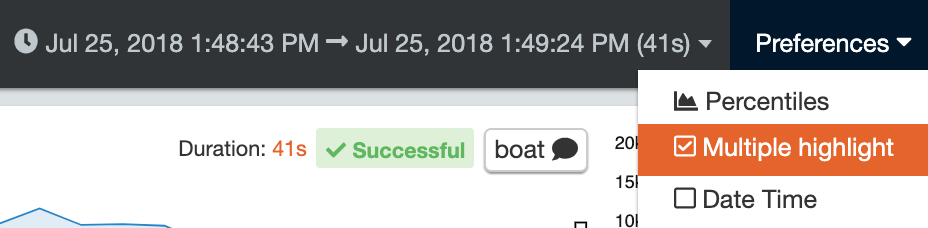
image::images/multiple.png[Marker,align=center]

====== Percentiles Mask

In the top right menu, you can click on the *Percentiles* setting to be able to chose what percentiles to display in the chart.

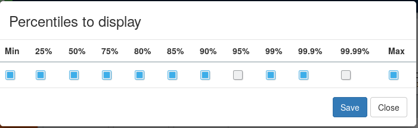
image::images/percentileschart.png[Mask,align=center]

====== Date Time / Elapsed Time

In the top right menu, you can activate the *Date Time* setting to be able to switch from elapsed time to date time.

====== Highlight Legend

By hovering the label on the percentiles chart legend, you will be able to highlight the curve on the chart, leading to a better view of that curve.
The highlight legend options is enable to every "non stacked" graph.

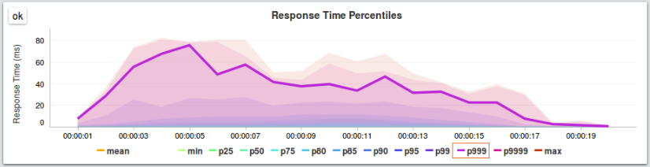

=== Documentation

You can click on the Documentation icon in the navigation bar on the bottom left of the screen to display every link to the FrontLine documentation and samples.

image::images/documentation.png[Mask,align=center]

=== Plugins Download

If you want to download one of your official FrontLine plugin, please click on the Plugins icon in the navigation bar. For more informations about the plugins, please refer to our plugins guide: https://gatling.io/docs/frontline/FrontLine-Plugins-Guide.pdf

image::images/plugins_modal.png[Mask,align=center]

=== About

You can click on the About icon in the navigation bar to display the informations about your FrontLine version and about your license.

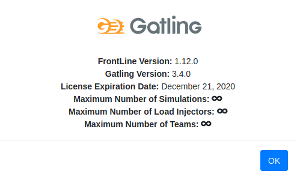
